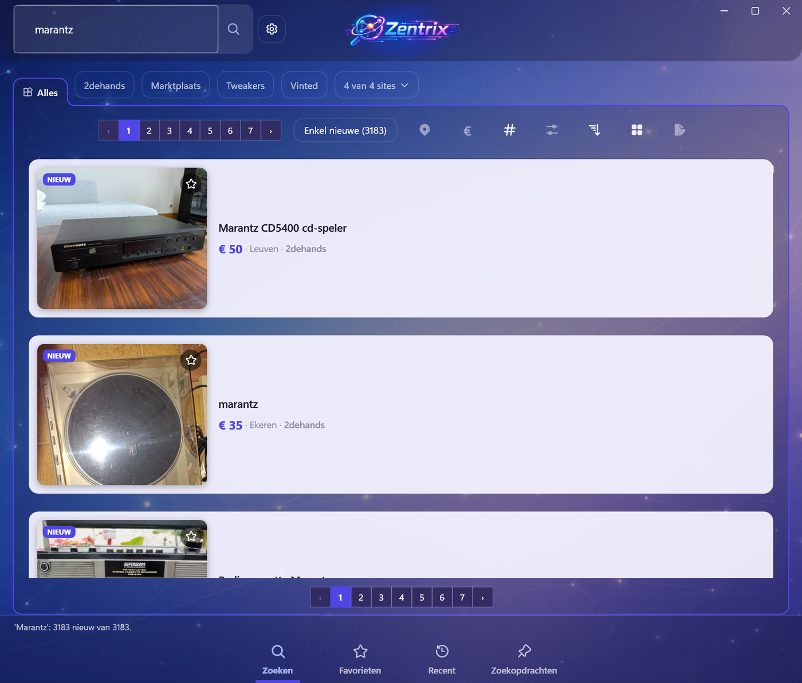

# Zentrix

**Eén zoekopdracht over al je tweedehandssites tegelijk.**

Zentrix is een Windows-desktopapp die meerdere tweedehands- en veilingsites naast elkaar
doorzoekt en de resultaten in één lijst zet. Het doel is eenvoudig: het dagelijkse rondje langs
tien sites — dat anders een voormiddag kost — terugbrengen tot één minuut.

Gemeten op acht sites tegelijk met het woord "cd": **621 resultaten in 35 seconden.**



<sub>Eén zoekterm over vier sites, alles in één lijst, met per zoekertje de prijs, de plaats en van
welke site hij komt. De tabbladen bovenaan tonen elke site ook apart. De sitebestanden op deze foto
zijn eigen bestanden — de app komt zonder sites, zie *De app komt zonder sites* hieronder.</sub>

---

## Wat het doet

- **Zoeken over meerdere sites tegelijk**, met per site zijn eigen filters (postcode, straal,
  prijs) en zijn eigen tabblad, plus een tabblad *Alles* met alles samen. Resultaten verschijnen
  terwijl de rest nog binnenkomt.
- **Vanzelf blijven zoeken.** Elke bewaarde zoekopdracht heeft een schema — om het uur, of
  dagelijks om acht uur — en de app draait daarvoor door in het systeemvak. Is er iets nieuws,
  dan komt er een melding via het systeemvak, **Telegram** of e-mail.
- **Nieuw is wat je nog niet bekeek**, niet wat er bij de laatste beurt bijkwam. De teller loopt
  op over de beurten heen tot je de zoekopdracht opent.
- **Prijsindicatie.** Wat is dit ongeveer waard? De app zoekt hetzelfde model op de sites die je
  als prijsbron aanvinkt, gooit er de veilingen, sets en afstandsbedieningen uit, en toont de
  mediaan met alle vergelijkingen eronder — zodat je ziet waar het getal vandaan komt.
- **AI-controle op een foto**, lokaal op je eigen grafische kaart (Ollama). Voor wat je met het
  blote oog niet ziet: de titels op een doos vol dvd's, of het typenummer op het label achteraan
  een oude versterker. Er gaat geen foto de deur uit.
- **Alles van één zoekertje** met een dubbelklik: alle foto's van de advertentie, de verkoper,
  hoelang het online staat en de volledige beschrijving — zonder de browser te openen.

## Hoe het binnenkomt

Elke site komt langs één van drie wegen binnen, en dat staat per site in een bestand:

| Weg | Wanneer |
|---|---|
| **Rechtstreeks** (`HttpClient`) | de snelste; werkt bij sites met een gewone pagina of een JSON-API |
| **Playwright** | wanneer er een echte browser nodig is, met een eigen profiel zodat je aangemeld blijft |
| **De brug** | een Chrome-extensie die pagina's in je **eigen** browser ophaalt, voor sites die een onzichtbare browser weigeren |

Bij die laatste twee blijft alles op je eigen pc: de brug luistert enkel op `127.0.0.1` en er
komt nergens iets centraal samen.

## Aan de slag

Je hebt nodig: **Windows**, de **.NET 10 SDK** en **Visual Studio 2022** of gewoon `dotnet`.

```bash
git clone https://github.com/dees743-cloud/Zentrix.git
```

```bash
dotnet run --project Zentrix.csproj
```

Een versie die je zonder .NET kan dubbelklikken, maak je zo:

```bash
dotnet publish Zentrix.csproj -c Release -r win-x64 --self-contained true -o C:\Zentrix
```

Optioneel:

- **Ollama** met een vision-model (`qwen3.5:9b`) op `127.0.0.1:11434`, als je de AI-controle wil.
- Een **`ANTHROPIC_API_KEY`** in je omgevingsvariabelen, als je een onbekende site automatisch wil
  laten analyseren. De app vraagt er zelf naar en zet hem voor je klaar.

## De app komt zonder sites

Dat is met opzet. Een algemene zoekmotor delen is iets anders dan kant-en-klare bestanden die op
bepaalde sites gericht zijn, en een deel daarvan omzeilt bewust de beveiliging tegen robots.
**De sitebestanden zijn daarom niet openbaar.**

De app kent dan ook geen enkele site bij naam: elke site is een JSON-bestand met zijn zoek-URL,
zijn selectors en zijn filters. Bij de eerste start zie je *Nog geen sites* met twee knoppen:

- **Site toevoegen** — plak een gewone zoek-URL van een site met je zoekwoord erin. De app haalt
  die pagina op, laat Claude bepalen waar titel, prijs, plaats, link en foto staan, en **telt het
  antwoord daarna na met de echte motor**. Wat eruit komt, staat in bewerkbare velden met een
  testknop ernaast.
- **Sites importeren uit map** — als je er al hebt.

Hoe je een site inregelt, wat er dan meestal misgaat en hoe je meet of een filter écht iets doet,
staat uitgebreid in [CLAUDE.md](CLAUDE.md) onder *Sites toevoegen*.

## Documentatie

[CLAUDE.md](CLAUDE.md) is het werkdagboek van dit project: hoe alles in elkaar zit, waarom het zo
gebouwd is, wat er gemeten is en vooral **wat er misging en waarom**. Het is geschreven om niets
twee keer te moeten uitzoeken. Wie aan de code wil werken, begint daar.

De controles draai je zonder testframework en zonder netwerk:

```bash
dotnet run --project tests\Zentrix.Checks -- --snel
```

## Status

**Versie 0.9.0.** De app wordt dagelijks gebruikt en doet wat ze moet doen, maar er staan nog
stukken open — zie *Volgende stappen* in CLAUDE.md. Vandaar de nul vooraan.

## Licentie

[MIT](LICENSE).

---

<sub>**In English** — Zentrix is a Windows desktop app that searches several second-hand and
auction sites at once and merges the results into one list, with scheduled searches, notifications,
a price indication built from real asking prices, and an on-device AI check that reads what is
written on the photos. The interface and the documentation are in Dutch. It ships without any site
definitions: the app knows no site by name, and each site is a JSON file you add yourself.</sub>
